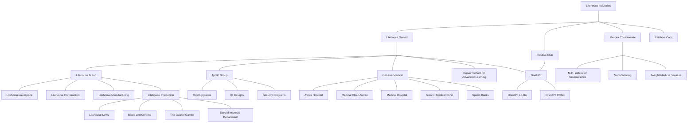

#AA_Corporation
#### Owners
- [[../Players/Saturday/Cat|Cat]]
- [[../NPCs/Friendly/Denver/Merlin|Merlin]] 
- [[../Players/Saturday/Incubus|Incubus]]
- [[../Players/London/Nightowl|Nightowl]]
- [[../Players/London/Elfo|Elfo]]

#### Litehouse Industries Original Board
- [[../Players/Saturday/Cat|Cat]] - 3 Votes
- [[../NPCs/Friendly/Denver/Merlin|Merlin]] - 2 Votes
- [[../NPCs/Friendly/Denver/Kalt|Kalt]] - 2 Votes
- [[../NPCs/Friendly/Denver/Jess|Jess]] - 1 Vote
- [[../NPCs/Friendly/Denver/Steve|Steve]] - 1 Vote

#### Litehouse Industries Current Board
1 vote each
- [[../Players/Saturday/Cat|Cat]]
- [[../NPCs/Friendly/Denver/Merlin|Merlin]]
- [[../Players/Saturday/Incubus|Incubus]]
- [[../Players/London/Elfo|Elfo]]
- [[../Players/London/Nightowl|Nightowl]]

#### Corporate Layout

#### [[../Players/Saturday/Cat| Cat]] Owns
- [[../Lighthouse Industries/1UP!|1UP!]]
- [[../Lighthouse Industries/Litehouse Brand|Litehouse Brand]]
-  [[../Lighthouse Industries/Genesis Medical|Genesis Medical]]
-  [[../Lighthouse Industries/The Apollo Group|The Apollo Group]]
-  Yearly Profit 19.42 Mil nuyen

#### [[../Players/Saturday/Incubus|Incubus]] Owns
- [[../Lighthouse Industries/Incubus Club|Incubus Club]]
- 

#### [[../Players/London/Nightowl|Nightowl]] Owns
- [[../Lighthouse Industries/Mercea Conglomerate|Mercea Conglomerate]]
- [[../Lighthouse Industries/Rainbow Corp|Rainbow Corp]]